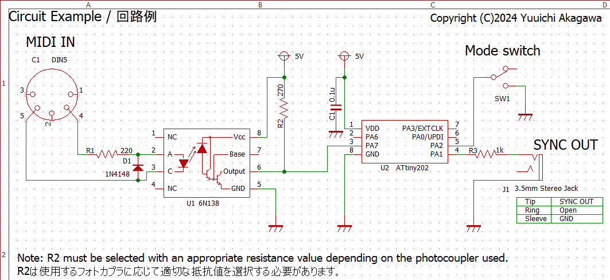

# MIDItoSyncConverter
MIDIクロックメッセージを2PPQのSYNC信号に変換します

## ビルド方法
### ターゲットマイコン
- Microchip ATtiny202

  

### ビルド
このプロジェクトのビルドにはPlatformIOが必要です。
- platform: Atmel megaAVR 1.9.0

ビルドが完了したら、[UPDI](https://www.google.com/search?q=microchip+updi)で書き込みを行ってください。

## 使用方法
送信側の機器とMIDIケーブルで、受信側の機器と3.5mmのステレオミニケーブルで接続します。  
モードスイッチでMIDI START/STOPメッセージと連動してSync信号を出力するか、連動しないかを選択することができます。

### モードスイッチ
PA2ピンにモードスイッチ機能を割り当てています。PA2端子は内部プルアップしているので開放時はHになります。

|PA2 |動作|
|----|---------|
|L|MIDI Start/Stopメッセージに連動してSync信号を出力します|
|H|MIDIクロックを受信している間はSync信号を出力し続けます|

## Sync信号のパルス幅について
このプロジェクトではSync信号のパルス幅を5msに設定しています。  
コルグの仕様では15msですが、他の多くの会社の機器では5msに設定されていることによります。
パルス幅は ```TCA.SINGLE.PER``` in ```TCA0_init()``` で変更できます。

## SysExによるPPQ値変更
PPQ値をSysExメッセージにて変更することが可能です。  
1から24までの値を指定できますが24の約数でなければ正しく動作しません。  
PPQ値はEEPROMの0x00番地に格納されます。

|Byte[Hex] | Description                                     |
|:--------:|-------------------------------------------------|
|F0        | Exclusive Status                                |
|7E        | non realtime Universal System Exclusive Message |
|49        | Device ID                                       |
|0B        | File Reference Message                          |
|02        | Change (Select or Reselect)                     |
|nn        | PPQ : 1,2,3,4,6,8,0C(12d),18(24d)               |
|F7        | End Of Exclusive                                |

## SysExによるSync信号パルス幅の変更
Sync信号パルス幅をSysExメッセージにて変更することが可能です。  
5ms,15msのいずれかを設定できます。  
Sync信号パルス幅値はEEPROMの0x01番地に格納されます。

|Byte[Hex] | Description                                             |
|:--------:|---------------------------------------------------------|
|F0        | Exclusive Status                                        |
|7E        | non realtime Universal System Exclusive Message         |
|49        | Device ID                                               |
|0B        | File Reference Message                                  |
|02        | Change (Select or Reselect)                             |
|nn        | Pulse Width 5ms:3F(63d), 15ms:5F(95d), Reserved:7F(127d)|
|F7        | End Of Exclusive                                        |

assets/sysexにSysExファイルを格納しています。必要に応じて使用してください。

【注意】SysExメッセージは独自のものを定義するのではなく、ユニバーサル・システム・エクスクルーシブのFile Reference Messageを流用しています。

## ライセンス
MIDItoSyncConverter is open source and licensed under the [GPL3](/LICENSE) License.
