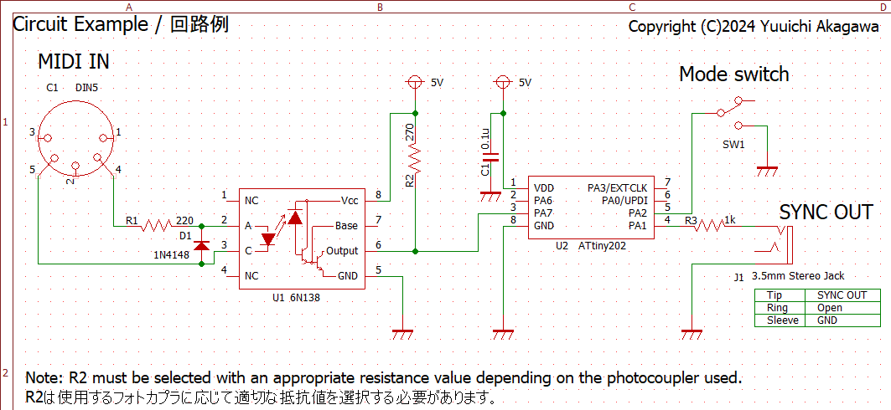

# MIDItoSyncConverter
Converts MIDI clock messages to 2PPQ sync signals.

[日本語版](README-ja.md)

## How to build
### Target microcontroller
- Microchip ATtiny202

  

### Build
This project uses PlatformIO to build.
- platform: Atmel megaAVR 1.9.0

When the build is complete, write via [UPDI](https://www.google.com/search?q=microchip+updi).

## Usage
Connects to the sending MIDI device with a MIDI cable and to the receiving device with a 3.5 mm stereo cable.  
The mode switch can be used to select the action to be taken when a MIDI START/STOP message is received.

### Mode switch
The PA2 pin is assigned to mode switch. PA2 is pulled up and goes High when open.

|PA2 |behaviour|
|----|---------|
|Low |Sends out or stops the sync signal in conjunction with MIDI Start and Stop messages.|
|High|Free run. When MIDI Clock is received, the Sync signal is sent regardless of the playback status of the MIDI device.|

## About the pulse width of the sync signal
In this project, the pulse width of the sync signal is set to 5 ms.  
The reason for this is that the KORG specification is 15 ms, but many other companies' devices use 5 ms.  
If you want to change this, change the value of ```TCA.SINGLE.PER``` in ```TCA0_init()``` and rebuild.

## Change the PPQ via SysEx message
The PPQ values can be changed using SysEx messages.  
You can specify a value between 1 and 24, but it will not work correctly unless it is a divisor of 24.  
The PPQ value is stored in the EEPROM at location 0x00.

|Byte[Hex] | Description                                     |
|:--------:|-------------------------------------------------|
|F0        | Exclusive Status                                |
|7E        | non realtime Universal System Exclusive Message |
|49        | Device ID                                       |
|0B        | File Reference Message                          |
|02        | Change (Select or Reselect)                     |
|nn        | PPQ : 1,2,3,4,6,8,0Ch(12),18h(24)               |
|F7        | End Of Exclusive                                |

## Change the Sync signal pulse width via SysEx message
The Sync signal pulse width can be changed using a SysEx message.  
It can be set to 5ms or 15ms.  
The Sync signal pulse width value is stored in the EEPROM at location 0x01.

|Byte[Hex] | Description                                             |
|:--------:|---------------------------------------------------------|
|F0        | Exclusive Status                                        |
|7E        | non realtime Universal System Exclusive Message         |
|49        | Device ID                                               |
|0B        | File Reference Message                                  |
|02        | Change (Select or Reselect)                             |
|nn        | Pulse Width 5ms:3Fh(63), 15ms:5Fh(95), Reserved:7Fh(127)|
|F7        | End Of Exclusive                                        |


SysEx files are stored in assets/sysex. Use as needed.

Note: The SysEx message does not define a dedicated one, but rather diverts the universal system-exclusive File Reference Message.

## License
MIDItoSyncConverter is open source and licensed under the [GPL3](/LICENSE) License.
